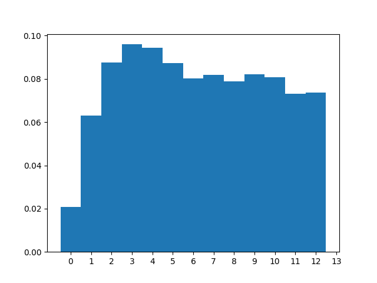

# Статистическое исследование
λ = 3.55

μ = 1.50

p = 0.80

n = 3, m = 10

|                  |   count |    mean |      std |   min |   25% |   50% |   75% |   max |
|:-----------------|--------:|--------:|---------:|------:|------:|------:|------:|------:|
| Размер очереди   |  285689 | 3.8977  | 3.34093  |     0 |     0 |     3 |     7 |    10 |
| Занятые каналы   |  285689 | 2.73904 | 0.655844 |     0 |     3 |     3 |     3 |     3 |
| Заявки в системе |  285689 | 6.63675 | 3.69137  |     0 |     3 |     6 |    10 |    13 |

|                         |   count |    mean |     std |   min |   25% |   50% |   75% |   max |
|:------------------------|--------:|--------:|--------:|------:|------:|------:|------:|------:|
| Время запроса в очереди |    9315 | 1.16099 | 1.15083 |  0    |  0.2  |  0.93 |  1.75 | 10.52 |
| Время запроса в системе |    9315 | 1.98205 | 1.51554 |  0.01 |  0.89 |  1.69 |  2.68 | 12.63 |

Всего отклонено: 2324

Всего отменено: 685

Всего выполнено: 9315

|                           |         0 |         1 |         2 |         3 |         4 |         5 |         6 |         7 |         8 |         9 |        10 |        11 |        12 |        13 |
|:--------------------------|----------:|----------:|----------:|----------:|----------:|----------:|----------:|----------:|----------:|----------:|----------:|----------:|----------:|----------:|
| Теоретическая вероятность | 0.0189978 | 0.0562019 | 0.083132  | 0.0819774 | 0.0808389 | 0.0797161 | 0.0786089 | 0.0775171 | 0.0764405 | 0.0753788 | 0.0743319 | 0.0732995 | 0.0722815 | 0.0712776 |
| Практическая вероятность  | 0.0196857 | 0.0595788 | 0.0827403 | 0.090637  | 0.0892089 | 0.0825128 | 0.0758027 | 0.0771713 | 0.0745671 | 0.0775599 | 0.0761632 | 0.0690401 | 0.0696037 | 0.0557284 |

|                                      |     Теор. |   Практ. |
|:-------------------------------------|----------:|---------:|
| Вероятность отказа                   | 0.0712776 |  0.0685  |
| Относительная пропускная способность | 0.928722  |  0.9315  |
| Абсолютная пропускная способность    | 3.29696   |  3.30682 |
| Длина очереди                        | 4.09067   |  3.8977  |
| Количество занятых каналов           | 2.74747   |  2.73904 |
| Количество заявок в системе          | 6.83814   |  6.63675 |

