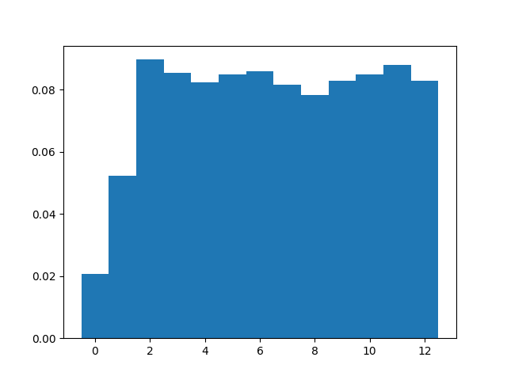

# Статистическое исследование
λ = 3.55

μ = 1.50

p = 0.80

n = 3, m = 10

|                  |   count |    mean |      std |   min |   25% |   50% |   75% |   max |
|:-----------------|--------:|--------:|---------:|------:|------:|------:|------:|------:|
| Размер очереди   |  282231 | 4.15661 | 3.37556  |     0 |     1 |     4 |     7 |    10 |
| Занятые каналы   |  282231 | 2.75972 | 0.629761 |     0 |     3 |     3 |     3 |     3 |
| Заявки в системе |  282231 | 6.91632 | 3.71329  |     0 |     4 |     7 |    10 |    13 |

|                         |   count |    mean |     std |   min |   25% |   50% |   75% |   max |
|:------------------------|--------:|--------:|--------:|------:|------:|------:|------:|------:|
| Время запроса в очереди |    9217 | 1.23136 | 1.17519 |  0    |  0.26 |  0.99 |  1.85 |  9.02 |
| Время запроса в системе |    9217 | 2.05659 | 1.55672 |  0.01 |  0.93 |  1.75 |  2.76 | 13.87 |

Всего отклонено: 2285

Всего отменено: 783

Всего выполнено: 9217

|                           |         0 |         1 |         2 |         3 |         4 |         5 |         6 |         7 |         8 |         9 |        10 |        11 |        12 |        13 |
|:--------------------------|----------:|----------:|----------:|----------:|----------:|----------:|----------:|----------:|----------:|----------:|----------:|----------:|----------:|----------:|
| Теоретическая вероятность | 0.0189978 | 0.0562019 | 0.083132  | 0.0819774 | 0.0808389 | 0.0797161 | 0.0786089 | 0.0775171 | 0.0764405 | 0.0753788 | 0.0743319 | 0.0732995 | 0.0722815 | 0.0712776 |
| Практическая вероятность  | 0.0193033 | 0.0491158 | 0.0841403 | 0.0802038 | 0.0771744 | 0.0796936 | 0.0805936 | 0.0765649 | 0.0735497 | 0.0777413 | 0.0795944 | 0.082397  | 0.0778086 | 0.0621193 |

|                                      |     Теор. |   Практ. |
|:-------------------------------------|----------:|---------:|
| Вероятность отказа                   | 0.0712776 |  0.0783  |
| Относительная пропускная способность | 0.928722  |  0.9217  |
| Абсолютная пропускная способность    | 3.29696   |  3.27203 |
| Длина очереди                        | 4.09067   |  4.15661 |
| Количество занятых каналов           | 2.74747   |  2.75972 |
| Количество заявок в системе          | 6.83814   |  6.91632 |

